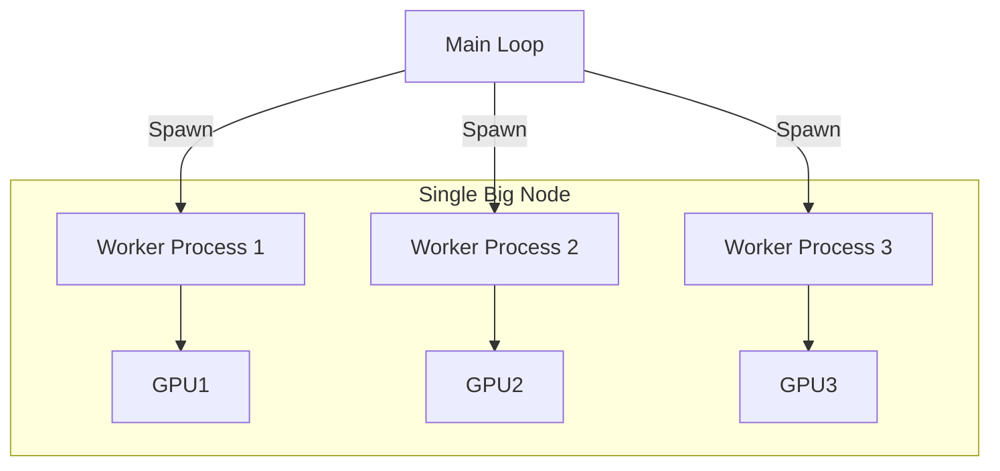

# Architecture Analysis & Debugging Report

## 1. Debugging Findings: "None" & Duplicate Fitness Scores

### Root Causes
1. **Timeouts**: The recent run ended because both `server` and `run_improved.py` hit the **8-hour QOS limit**. When the server dies, any in-flight requests fail/retry until timeout, leading to `None` or fallback values.
2. **Zombie Genes**: Logs show `File not found` for some network files. If a previous generation failed to write a file (or was cancelled), the "zombie" gene persists but cannot be evaluated, returning Invalid/None fitness.
3. **Traceback in stderr**: The `evaluate` jobs check for "traceback" in stderr. If found, they return `False`. However, warnings (like `FutureWarning`) do NOT trigger failure, allowing the job to proceed. If the job didn't write a results file but didn't crash with "traceback", the logic might return `None` or try to parse non-existent file.

### Improvement
- **Robust Error Handling**: Enhance `check4results` to treat *missing results file* as an explicit failure (fitness -9999) rather than `None`.
- **Walltime Sync**: Ensure `run.sh` has a slightly shorter timeout than `server.sh`, or gracefully handles shutdown.

---

## 2. Verify: Compute Metrics vs Latency

**Current State**: 
- `server.py` logs `Current VRAM` periodically.
- `server.py` logs *Latency* (E2E and Batch Processing time) per request.
- **Missing**: Real-time GPU Utilization (%) and Memory Bandwidth usage.

**Improvement**: 
- I added a background `nvidia-smi` logger to `server.sh`.
- **Output**: `server_gpu_metrics.csv`
- **Correlation**: We can join this CSV (by timestamp) with `slurm-server-*.out` request logs to plot `Batch Size` vs `Util %` vs `Latency`.

---

## 3. Evaluation Architecture: Job-per-Gene vs Local Pool

### Current Architecture: "Job-per-Gene" (Distributed)
```mermaid
graph TD
    M[Main Loop (run_improved.py)] -->|sbatch| J1[Job Gene 1]
    M -->|sbatch| J2[Job Gene 2]
    M -->|sbatch| J3[Job Gene 3]
    J1 -.->|Wait Queue| Node1[Compute Node]
    J2 -.->|Wait Queue| Node2[Compute Node]
    J3 -.->|Wait Queue| Node3[Compute Node]
    Node1 -->|Result| M
```
- **Pros**: 
    - **Scalability**: Can run 100+ evaluations in parallel if cluster allows.
    - **Isolation**: One job crashing (OOM/Segfault) doesn't kill others.
    - **Heterogeneity**: Can request different resources for different genes.
- **Cons**: 
    - **Overhead**: `sbatch` might take 1-5 mins to start. If eval takes only 1 min, overhead > work.
    - **Filesystem**: Heavy IO on shared storage (creating script, reading log).

### Alternative Architecture: "Local Worker Pool"

- **Strategy**: Request **one large node** (e.g. 4x GPUs) in `run.sh`, then use Python `multiprocessing` or `concurrent.futures` to run evaluations locally on that node.
- **Pros**: 
    - **Zero Latency**: No queue time per gene.
    - **Efficient**: Good for short evaluations (< 5 mins).
- **Cons**: 
    - **Limited Scale**: Bottlenecked by single node capacity (max 4-8 GPUs).
    - **Fragile**: If Main Loop OOMs, everything dies.

### Recommendation
- **If Eval Time > 10 mins**: Stick with **Job-per-Gene** (Current). The queue time is negligible compared to compute.
- **If Eval Time < 2 mins**: Switch to **Local Worker Pool**.
- **Hybrid**: Submit "Batch Jobs" where one job evaluates 10 genes sequentially.

Given we are training CNNs (Cifar10), training likely takes **5-15 mins**?
**Job-per-Gene** is likely reasonably effective, provided `BadConstraints` (Queue issues) are resolved.
