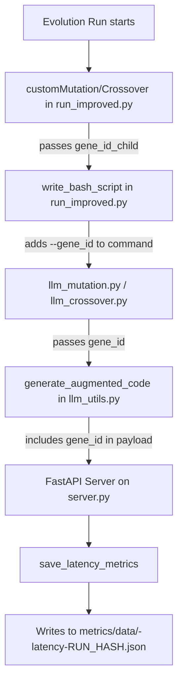

# Feature Guide: End-to-End Latency Tracking

This document provides a comprehensive overview of the `gene_id`-based latency tracking feature.

## 1. Goal

The primary goal is to enable end-to-end latency metrics for each individual (`gene_id`) in the evolutionary process. This allows us to analyze the relationship between LLM inference performance and the quality of the resulting models by plotting:

1.  **Latency vs. Accuracy**: How does inference speed correlate with model performance?
2.  **Latency vs. Goodput**: How does inference speed affect the rate of successful model evaluations per generation?

## 2. How It Works

### Data Flow for `gene_id`

The `gene_id` is propagated through the entire evolution and evaluation pipeline, from the genetic operators in the main script down to the inference server.



The final JSON output contains a record for each request, tagged with the specific `gene_id`.

```json
{
  "run_hash": "abc123def456",
  "requests": [
    {
      "timestamp": "...",
      "gene_id": "xXxabc123...",
      "_latency_sec": 2.345,
      "prompt_length": 1234,
      "batch_size": 8
    }
  ]
}
```

## 3. Analysis Scripts

Two dedicated scripts were created to analyze the collected latency data.

### `scripts/plot_latency_vs_accuracy.py`

This script correlates LLM inference latency with the final test accuracy of the models.

**Usage:**

```bash
python scripts/plot_latency_vs_accuracy.py \
    --run-id <RUN_ID> \
    --run-hash <RUN_HASH> \
    --output latency_accuracy_analysis.png
```

**Analysis Flow:**
1.  Loads latency data from `metrics/data/-latency-{RUN_HASH}.json`.
2.  Loads accuracy results from `runs/{run_id}/results/*_results.txt`.
3.  Merges the data on `gene_id`.
4.  Generates two scatter plots:
    *   **Latency vs. Accuracy**, colored by prompt length.
    *   **Latency vs. Model Parameters**, colored by accuracy.
5.  Calculates and displays correlation coefficients and top-performing individuals.

**Key Insights:**
*   Do faster LLM requests lead to better or worse models?
*   What is the relationship between prompt length, latency, and accuracy?
*   Which individuals represent the best tradeoff between inference speed and model quality?

### `scripts/plot_latency_vs_goodput.py`

This script analyzes the stability and efficiency of the evolutionary process over time. **Goodput** is defined as the percentage of individuals in a generation that successfully produce a valid fitness score.

**Usage:**

```bash
python scripts/plot_latency_vs_goodput.py \
    --run-id <RUN_ID> \
    --run-hash <RUN_HASH> \
    --output goodput_analysis.png
```

**Analysis Flow:**
1.  Loads all `checkpoint_gen_*.pkl` files from `runs/{run_id}/checkpoints/`.
2.  For each generation, it calculates the goodput percentage.
3.  Optionally loads latency data to correlate with goodput over generations.
4.  Generates a dual-axis plot showing **Goodput (%)** and **Average Latency (s)** across generations.

**Key Insights:**
*   Is the evolutionary process stable (i.e., high goodput > 90%)?
*   Are we losing individuals due to invalid code generation from the LLM?
*   Does LLM latency increase over generations as prompts potentially become more complex?

## 4. Full Workflow Example

Here is the recommended workflow for using this feature:

1.  **Start a new run:**
    ```bash
    sbatch run.sh
    ```
    *   Note the `RUN_ID` from the output (e.g., `auto_20251014_103000`).

2.  **Find the `RUN_HASH`:**
    *   Check the server log for the unique hash associated with the metrics file.
    ```bash
    grep "run_hash" slurm-results/slurm-server-*.out
    ```
    *   Note the `RUN_HASH` (e.g., `abc123def456`).

3.  **Wait for the run to complete.**
    *   You can monitor its status with `squeue`.

4.  **Generate analysis plots:**
    ```bash
    # Analyze latency vs. accuracy
    python scripts/plot_latency_vs_accuracy.py --run-id auto_20251014_103000 --run-hash abc123def456

    # Analyze evolution stability
    python scripts/plot_latency_vs_goodput.py --run-id auto_20251014_103000 --run-hash abc123def456
    ```

## 5. Future Enhancements

*   **Combined Dashboard**: A single script to generate a full HTML report with all analysis plots.
*   **Store Generation Number in Metrics**: Add the generation number directly to the latency logs for more precise time-series analysis, removing the need for approximation.
*   **Unified Analysis Script**: A single entry point for all post-run analysis (`python scripts/analyze_run.py --all`).
