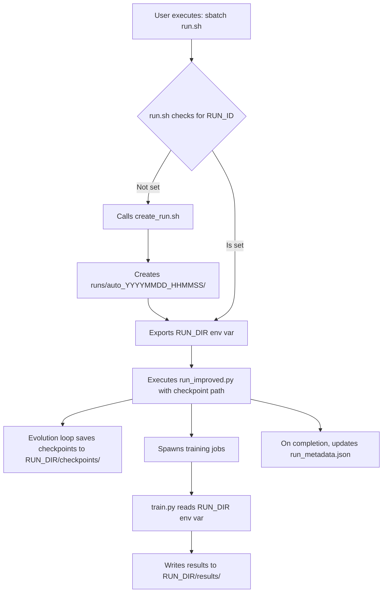

# Feature Guide: Automated Run Management

This document explains the automated system for creating, managing, and analyzing evolutionary runs.

## 1. The Problem It Solves

Previously, checkpoints and results were stored in separate, hardcoded directories (`first_test/` and `sota/ExquisiteNetV2/results/`). This led to several issues:
*   **No Clear Connection**: It was difficult to determine which results belonged to which experiment or code version.
*   **Risk of Overwriting**: Starting a new run could overwrite the results of a previous one.
*   **No Provenance**: There was no metadata linking results back to a specific git commit or timestamp.
*   **Manual Effort**: Required manual creation and management of directories for each new experiment.

The new run management system solves these problems by creating a self-contained, timestamped directory for every single run.

## 2. How It Works

### Directory Structure

All experiments are now stored within the `runs/` directory.

```
runs/
├── latest -> auto_20251014_103000  (symlink to the most recent run)
│
└── auto_20251014_103000/
    ├── checkpoints/               # Evolution checkpoints (*.pkl)
    ├── results/                   # Final model results (*_results.txt)
    ├── logs/                      # Additional logs (optional)
    └── run_metadata.json          # Experiment metadata (git info, etc.)
```

### Automated Workflow

The entire process is automated via the main submission script, `run.sh`.



### Key Components

*   **`run.sh`**: The main SLURM submission script. It now includes logic to automatically create a run directory if one isn't specified. It also exports the `RUN_DIR` environment variable, which is inherited by all child processes.
*   **`scripts/create_run.sh`**: A helper script that generates the timestamped directory, creates the `checkpoints/`, `results/`, and `logs/` subdirectories, and writes the initial `run_metadata.json` file.
*   **`sota/ExquisiteNetV2/train.py`**: The training script was modified to check for the `RUN_DIR` environment variable. If it exists, results are written to the correct `results/` subdirectory, ensuring encapsulation.
*   **`run_metadata.json`**: A critical file containing experiment provenance:
    ```json
    {
      "run_id": "auto_20251014_103000",
      "created_at": "2025-10-14T10:30:00-04:00",
      "git_branch": "feat/surya",
      "git_commit": "a3333277a4576456b5c3063119721c19de48301f",
      "status": "completed",
      "completed_at": "2025-10-14T12:45:10-04:00"
    }
    ```

## 3. Usage Guide

### Quick Start: The One Command You Need

For most cases, you only need one command to start a new, fully-managed experiment:

```bash
sbatch run.sh
```

This will automatically create a new `runs/auto_YYYYMMDD_HHMMSS/` directory and handle all file organization.

### Continuing from an Existing Run

To continue a previous run from its last checkpoint, set the `RUN_ID` environment variable:

```bash
export RUN_ID=auto_20251014_103000
sbatch run.sh
```

This will resume evolution from the latest checkpoint in the specified run directory.

### Advanced Usage

*   **Creating a Named Run**: For better organization, you can create a run with a descriptive name before starting.
    ```bash
    # Step 1: Create the run directory
    bash scripts/create_run.sh "high_mutation_experiment"
    
    # Step 2: Set the RUN_ID and submit
    export RUN_ID=high_mutation_experiment_20251014_103500
    sbatch run.sh
    ```

*   **Resuming an Interrupted Run**: To continue a previous run from its last checkpoint:
    ```bash
    # Set the ID of the run you want to resume
    export RUN_ID=auto_20251014_103000
    sbatch run.sh
    ```
    The system automatically finds the latest checkpoint in the specified run directory and continues from there.

## 4. Analyzing Results

The new plotting scripts are designed to work seamlessly with the run management system.

### `scripts/plot_pareto_enhanced.py`

This is the primary script for visualizing the results of one or more runs.

*   **Plotting the Latest Run**:
    ```bash
    # No arguments needed, it automatically finds the latest run
    python scripts/plot_pareto_enhanced.py
    ```

*   **Plotting a Specific Run**:
    ```bash
    python scripts/plot_pareto_enhanced.py --run-id auto_20251014_103000
    ```

*   **Comparing Multiple Runs**:
    ```bash
    # Provide a list of run IDs to the --compare argument
    python scripts/plot_pareto_enhanced.py --compare \
        auto_20251014_103000 \
        high_mutation_experiment_20251014_103500 \
        --output experiment_comparison.png
    ```

The generated plots include a metadata box with the git commit, timestamp, and other information, providing full context for the results.

## 5. Migrating Old Data

The legacy `first_test` data can be migrated into the new system to be used with the enhanced analysis tools.

1.  **Create a run directory for the legacy data:**
    ```bash
    bash scripts/create_run.sh "first_test_archive"
    ```

2.  **Copy the old files into the new structure:**
    ```bash
    RUN_ID=first_test_archive_20251014_110000 # Use the actual ID from step 1
    
    # Copy checkpoints
    cp first_test/*.pkl runs/$RUN_ID/checkpoints/
    
    # Copy results
    cp sota/ExquisiteNetV2/results/*_results.txt runs/$RUN_ID/results/
    ```

3.  **Analyze with the new script:**
    ```bash
    python scripts/plot_pareto_enhanced.py --run-id $RUN_ID
    ```
