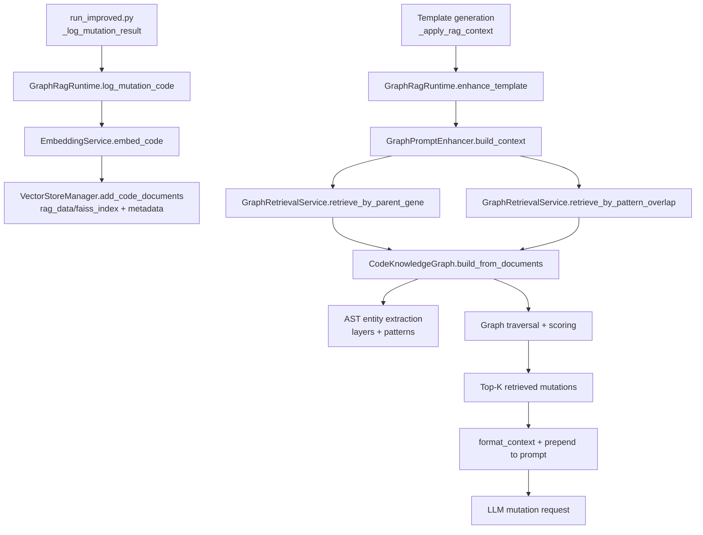

# Graph RAG Feature Documentation

**Date:** February 2026  
**Feature:** Graph-Augmented Retrieval Pipeline for LLM-Guided Evolution  
**Status:** Implemented

## Overview

The Graph RAG pipeline augments mutation prompts using a lightweight code knowledge graph built from previously logged mutation artifacts.

Instead of relying only on vector similarity, Graph RAG uses lineage and architecture structure to retrieve examples that are relevant to a parent gene and/or a target code snippet.

Key properties:

- No Neo4j dependency (file-backed NetworkX graph).
- Uses AST parsing to extract architecture entities.
- Stores graph snapshot in `rag_data/kg/code_kg.json`.
- Compatible with existing vector RAG storage (`rag_data/faiss_index` + `rag_data/metadata`).

## Architecture

### Components

1. **Graph Runtime** (`src/rag/graph_runtime.py`):
  - Orchestrates graph-mode services.
  - Provides singleton access through `get_graph_runtime()`.
  - Handles mutation logging and prompt enhancement API used by the run loop.

2. **Knowledge Graph Builder** (`src/rag/code_kg.py`):
  - Parses mutation source code with Python AST.
  - Extracts architecture entities (layers + patterns).
  - Builds a typed graph of genes, patterns, and layers.
  - Persists graph snapshot to disk.

3. **Graph Retrieval Service** (`src/rag/graph_retrieval.py`):
  - Parent-gene traversal retrieval.
  - Pattern/layer overlap retrieval from query code.
  - Hydrates graph hits using code documents and metadata from vector store.

4. **Graph Prompt Enhancer** (`src/rag/graph_prompt_enhancer.py`):
  - Combines retrieval strategies.
  - Deduplicates and score-sorts results.
  - Prepends graph context to templates for mutation generation.

5. **Shared Vector Storage** (`src/rag/vector_db.py` + `src/rag/embeddings.py`):
  - Maintains mutation artifacts and metadata in `rag_data`.
  - Provides source documents that Graph RAG transforms into graph structure.

## End-to-End Flow

### High-Level Execution Diagram



### Step-by-Step Flow

1. **Mutation artifacts are logged**
  - Successful mutations are logged through runtime (`log_mutation_code`) with metadata including:
    - `gene_id`
    - `parent_gene_id`
    - `mutation_type`
    - `fitness`
    - `improvement` deltas

2. **Graph retrieval is requested during template generation**
  - The run loop calls `enhance_template(...)` with context inputs:
    - `parent_gene_id` (lineage anchor)
    - `query_code` (optional structural anchor)

3. **Graph is built/refreshed from stored code documents**
  - `CodeKnowledgeGraph.build_from_documents(...)` consumes all code namespace documents.
  - Signature checks skip rebuild when corpus has not changed.

4. **AST extracts architecture entities from code**
  - Layer types such as `nn.Conv2d`, `BatchNorm2d`, `SEBlock` hints.
  - Patterns such as `residual_connection`, `skip_connection`, `squeeze_excite`.

5. **Graph traversal scores candidate genes**
  - Parent-based signals: descendant/improvement edges.
  - Shared-feature signals: overlapping layers and patterns.
  - Candidates are filtered by quality (min accuracy, fallback exclusion).

6. **Prompt context is assembled**
  - Retrieved candidates are deduplicated and ranked.
  - `top_k` examples are formatted with score/fitness/reason.
  - Context is prepended to the base template.

7. **LLM receives augmented prompt**
  - The resulting prompt guides new mutation generation with graph-informed historical examples.

## Graph Data Model

### Node Types

- `gene:<gene_id>`
- `layer:<layer_name>`
- `pattern:<pattern_name>`

### Edge Types

- `uses` (gene -> layer/pattern)
- `replaces` (child gene -> parent gene)
- `improves_accuracy` (child gene -> parent gene when `accuracy_delta > 0`)
- `reduces_params` (child gene -> parent gene when `parameters_delta < 0`)

### Candidate Scoring Signals

`related_successful_genes(parent_gene_id)` combines:

- Direct descendant signal (`replaces`)
- Positive optimization deltas (`improves_accuracy`, `reduces_params`)
- Shared architecture features (same layer/pattern nodes)

Final ranking is score-first with accuracy as tie-breaker.

## Configuration

Graph mode uses standard RAG config plus graph toggle in `src/cfg/constants.py`:

```python
RAG_MODE = "graph"                 # route runtime to graph mode
GRAPH_RAG_ENABLED = True            # enable graph runtime singleton
RAG_DATA_DIR = "rag_data/"         # vector + graph storage root
RAG_TOP_K = 5                       # number of context mutations injected
RAG_MIN_ACCURACY = 0.9              # retrieval quality threshold
RAG_CODE_EMBED_MODEL = "microsoft/codebert-base"
RAG_TEXT_EMBED_MODEL = "sentence-transformers/all-MiniLM-L6-v2"
```

### Environment Variable Overrides

```bash
export RAG_MODE=graph
export GRAPH_RAG_ENABLED=true
export RAG_TOP_K=5
export RAG_MIN_ACCURACY=0.90
```

## Setup and Initialization

### First-Time Setup

Build initial corpus from checkpoints and optional PDFs:

```bash
uv run python scripts/setup_rag.py
```

This creates/updates:

- `rag_data/faiss_index/*.index`
- `rag_data/metadata/*.jsonl`
- Graph snapshots when Graph retrieval is invoked (`rag_data/kg/code_kg.json`)

### Automatic Incremental Updates

During evolution runs, successful mutations are appended to the code namespace and become available for future graph rebuilds/retrieval.

## Integration Points

### 1. Runtime dispatch (`src/rag/runtime.py`)

- If `RAG_MODE == "graph"`, runtime resolves to `get_graph_runtime()`.

### 2. Template augmentation (`run_improved.py`)

- `_apply_rag_context(...)` calls runtime `enhance_template(...)`.
- In graph mode, this executes Graph Prompt Enhancer retrieval flow.

### 3. Post-eval artifact logging (`run_improved.py:_log_mutation_result`)

- Valid successful mutations are logged with metadata, enabling future graph context.

## Data Storage

### File Structure

```text
rag_data/
├── faiss_index/
│   ├── code.index
│   └── text.index
├── metadata/
│   ├── code.jsonl
│   └── text.jsonl
└── kg/
   └── code_kg.json
```

### Persistence Model

- Vector index + metadata are the canonical mutation artifact source.
- Graph is derived state rebuilt from mutation artifacts and persisted for reuse.
- No destructive cleanup happens automatically at run completion.

## Embeddings in Graph Mode

Embeddings are still used for artifact indexing/logging, but not for graph traversal ranking.

### Used for

- Logging/indexing new mutation artifacts into vector store.
- Maintaining compatibility with vector RAG data storage.

### Not used for

- `CodeKnowledgeGraph.related_successful_genes(...)` scoring logic.
- Parent-gene graph traversal ranking.

## Visualization

Use the helper script to generate presentation-ready figures from the persisted graph:

```bash
uv run python scripts/visualize_graph_rag.py
```

Optional focused view around a specific parent gene:

```bash
uv run python scripts/visualize_graph_rag.py --parent-gene-id <gene_id> --radius 2 --max-nodes 60
```

Outputs are written to `plots/graph_rag/`:

- `overview_counts.png` — node/edge type distribution for high-level architecture slides
- `subgraph.png` — readable local neighborhood graph around the selected focus gene
- `summary.json` — counts and selected focus metadata for speaker notes

Notes:

- If `rag_data/kg/code_kg.json` does not exist yet, run retrieval once (or run an evolution step) so the graph snapshot is created.
- For dense graphs, keep `radius` small and use `--max-nodes` to avoid clutter.

## Troubleshooting

### Empty Graph Retrieval Results

Possible causes:

1. `rag_data/metadata/code.jsonl` is empty/not created.
2. Graph mode disabled (`RAG_MODE` or `GRAPH_RAG_ENABLED` not set).
3. No candidates pass `RAG_MIN_ACCURACY`.
4. Parent gene not present in stored mutation artifacts.

### No `code_kg.json` file

Expected until graph retrieval is called at least once. It is created when `build_from_documents(...)` persists a graph snapshot.

### Setup failure on checkpoint artifacts

Some older checkpoints may contain placeholder/invalid fitness values. If setup fails, ingest only valid records or patch ingestion to skip non-finite fitness rows.

## References

- **NetworkX:** https://networkx.org/
- **FAISS:** https://github.com/facebookresearch/faiss
- **CodeBERT:** https://github.com/microsoft/CodeBERT
- **Sentence Transformers:** https://www.sbert.net/
