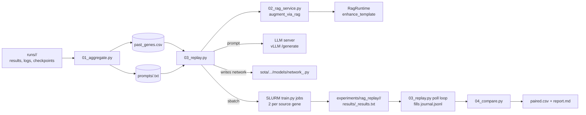

# RAG Replay Harness — Overview

**Branch:** `feature/rag-pipeline-surya`
**Date:** 2026-04-27
**Owner:** Surya Atmuri

## Why this exists

Existing RAG evaluation tooling in this repo answers either *condition-level*
questions (whole evolutionary runs with vs without RAG, via
`scripts/run_rag_ablation_matrix.py` + `scripts/summarize_rag_ablation.py`) or
*synthetic per-prompt* questions (the paired isolation harness on the
`feature/rag-testing` branch under `scripts/rag_isolation/`). Neither tells us
what would have happened if we had re-run the actual genes that LLMGE produced
**with RAG injected this time around**.

For the final stand-up we need numbers grounded in our own historical data:

> **Hypothesis:** Re-running each historical baseline mutation with RAG-augmented
> prompts produces (a) higher syntactic goodput per generation, (b) recovery of
> previously-fallback prompts, and (c) measurable test-accuracy lift on the
> CIFAR-10 task — at the cost of larger prompts and longer LLM latency.

## What the harness does



## Resolved decisions

| # | Decision | Rationale |
|---|---|---|
| Q1 | Source = all genes from runs where `RAG_ENABLED=false` at runtime. | Cleanest A/B; metadata.json + absence of `metrics/rag_metrics.jsonl` is the corroborating signal. Currently 156 genes (130 TEMPLATE_BASED-eligible). |
| Q1b | Fallback genes are kept and analyzed as a sub-cohort. | Goodput recovery (rescue rate) is itself a deliverable per the user's "goodput per LLMGE generation" framing. |
| Q2 | Regenerate **both** the no_rag and with_rag arms. ~140 train jobs. | Controls LLM-side stochasticity; the original gene's test_acc is one realization, not a population. Goodput especially is a per-prompt coin flip. |
| Q3 | RAG augmentation is in-process (`augment_via_rag()`), shape is HTTP-ready. | 70 calls is not throughput-bound; HTTP adds slurm-CPU job + port management for zero scientific benefit. The function shape lets us swap to FastAPI in 5 lines. |

## File map

```
scripts/rag_replay/
├── __init__.py
├── 01_aggregate.py          # walk runs/ → past_genes.csv + prompts/
├── 02_rag_service.py        # augment_via_rag(req) -> resp
├── 03_replay.py             # for-loop driver: regenerate × 2 arms, sbatch train
├── 04_compare.py            # join arms, paired stats, report.md
└── datasets/
    ├── past_genes.csv       # generated; one row per source gene
    └── prompts/<gid>.txt    # generated; verbatim historical PROMPT TO LLM

docs/rag_replay/
├── 00_overview.md           # this file
├── 01_aggregate.md          # aggregator design + diagram
├── 02_replay_loop.md        # replay sequence diagram + retry semantics
└── 03_metrics.md            # paired-stats definitions (goodput, recovery, deltas)
```

Per-replay outputs:

```
experiments/rag_replay/<ts>/
├── run_metadata.json
├── hostname.log             # for downstream HTTP submit
├── journal.jsonl            # one line per (orig_gene_id, arm) — pre and post-poll
├── paired.csv               # one row per source gene with both arms
├── report.md                # 04_compare.py output
├── results/<new_gid>_results.txt
├── slurm_logs/eval-<jobid>.out
├── slurm_errors/eval-<jobid>.err
├── sbatch/<new_gid>.sh
└── logs/                    # validation_errors.csv + per-gene LLM logs
```

## Quickstart

```bash
# 0. Make sure an LLM server is running
sbatch server.sh
# wait until hostname.log is populated

# 1. Build the source CSV (~30 sec)
.venv/bin/python scripts/rag_replay/01_aggregate.py

# 2. Smoke-test the replay loop end-to-end (3 source genes, 6 sbatch jobs)
.venv/bin/python scripts/rag_replay/03_replay.py \
  --output experiments/rag_replay/smoke_$(date +%Y%m%d_%H%M) \
  --max-rows 3 --epochs 5 --eligible-only

# 3. Run the analysis once results land (or reuse 03_replay.py --poll-only)
.venv/bin/python scripts/rag_replay/04_compare.py \
  experiments/rag_replay/smoke_<...>

# 4. Full replay (set epochs and let polling block on completion)
.venv/bin/python scripts/rag_replay/03_replay.py \
  --output experiments/rag_replay/$(date +%Y%m%d_%H%M) \
  --eligible-only --epochs 24 \
  --poll-timeout-hours 12
```

## Caveats baked in

1. **Augment-idx inference.** Historical prompts don't store the augment_idx
   that produced them. `03_replay.py:_find_augment_idx` matches the parent
   class block embedded in the prompt against `split_file(parent)` to recover
   the index. Edge case: if no class block matches, falls back to `idx=1`.
2. **Mutation type granularity.** `GLOBAL_DATA_ANCESTRY[gene_id]['MUTATE_TYPE']`
   stores `TEMPLATE_BASED` rather than the specific template (e.g., "Param").
   We pass this label through to `enhance_template`'s `mutation_type`; the
   retrieval layer falls back to similarity-only when the label isn't
   discriminative.
3. **Training stochasticity is uncontrolled.** Both arms use seed 21, but
   data shuffling adds variance. With N≈130 paired rows the central tendency
   should still surface; for finals we report median delta + IQR alongside
   the p-value, not just the p-value.
4. **RAG retrieval can be empty.** If the FAISS index doesn't return code or
   text for a particular prompt, `rag_block_chars` will be 0 and that row's
   "with_rag" arm collapses to the same prompt as "no_rag". `04_compare.py`
   surfaces this in the sanity-check section so we can drop or note these
   rows before headline numbers.
