# 01 — Aggregator design

`scripts/rag_replay/01_aggregate.py` walks the `runs/` directory and emits one
row per historical gene whose run was conducted **without** RAG, plus a
verbatim copy of that gene's original `[PROMPT TO LLM]` text.

## What "RAG-OFF" means here

A run is treated as RAG-OFF if its `runs/<RUN_ID>/run_metadata.json` records
`experiment.RAG_ENABLED in {"false", null, ""}` (`is_rag_off_run` at
`scripts/rag_replay/01_aggregate.py:97`). On disk we also confirm via the
absence of `runs/<RUN_ID>/metrics/rag_metrics.jsonl` — RAG runs always emit
that file via `utils.rag_metrics.record_metric` from
`src/rag/prompt_enhancer.py:246`.

## Diagram

```mermaid
flowchart TB
    Start[runs/* iter] --> Meta{run_metadata.json<br/>RAG off?}
    Meta -- no --> Skip[skip: rag_on]
    Meta -- yes --> Results[load_results<br/>scripts/rag_replay/01_aggregate.py:80]
    Results --> Anc[load_ancestry<br/>latest checkpoint pickle]
    Anc --> ForGene[for each gene_id]
    ForGene --> Log{logs/llm/gene_*.log<br/>exists?}
    Log -- no --> SkipLog[skip: no_log]
    Log -- yes --> Prompt[extract_first_prompt<br/>scripts/rag_replay/01_aggregate.py:38]
    Prompt --> ParentPath[resolve_parent_path<br/>via GENES&#91;-2&#93;]
    ParentPath --> Fallback{network_*.py.fallback<br/>exists in sota/models?}
    Fallback --> Row[GeneRow]
    Row --> Out[(past_genes.csv<br/>+ prompts/&lt;gid&gt;.txt)]
```



## Field reference — `past_genes.csv`

| column | source | notes |
|---|---|---|
| `orig_gene_id` | results filename | strips `_results.txt` |
| `orig_run_id` | `run_metadata.json` | falls back to dir name |
| `orig_rag_enabled` | hard-coded `"false"` | aggregator only emits RAG-OFF rows |
| `orig_mutation_op` | `GLOBAL_DATA_ANCESTRY[gid]['MUTATE_TYPE'][-1]` | one of `TEMPLATE_BASED`, `CrossOver`, `CREATED`, `SEED`, `UNKNOWN` |
| `orig_eligible_for_rag` | `mutation_op == 'TEMPLATE_BASED'` | crossover/initial-creation never go through RAG in production |
| `orig_parent_id` | `GENES[-2]`, unwrapped from `P:.../-C:...` form | falls back to `"network"` (seed) |
| `orig_parent_path` | `sota/.../models/network_<parent>.py` if exists, else seed | always resolvable |
| `orig_was_fallback` | presence of `network_<gid>.py.fallback` marker | the on-disk truth |
| `orig_test_acc`, `orig_params`, `orig_val_acc`, `orig_train_time_s` | results.txt parse | per `run_improved.py:734-818` field order |
| `orig_prompt_path` | written by aggregator | repo-relative |
| `orig_prompt_chars` | `len(prompt)` | sanity sample |

## Counts as of 2026-04-27

```
$ .venv/bin/python scripts/rag_replay/01_aggregate.py
wrote scripts/rag_replay/datasets/past_genes.csv with 156 rows
  by mutation_op: {'TEMPLATE_BASED': 130, 'CrossOver': 9, 'CREATED': 17}
  eligible_for_rag (TEMPLATE_BASED): 130
  fallback marker present: 39
  skipped: {'no_log': 0, 'no_results': 0, 'no_prompt': 0, 'rag_on': 2}
```

Per-run breakdown (genes / TEMPLATE_BASED-eligible / fallback-marker):

| run_id | total | eligible | fallback |
|---|---|---|---|
| `nemotron_rag_text_20260311_022245` | 86 | 74 | 18 |
| `nemotron_baseline_20260311_022419` | 70 | 56 | 21 |

> Note: the `nemotron_rag_text_20260311_022245` run name is aspirational —
> `run_metadata.json` records `RAG_ENABLED=false` and there is no
> `metrics/rag_metrics.jsonl`, so it is correctly classified as RAG-OFF.

## Edge cases handled

- **Crossover lineage.** Crossover ancestry rows store `GENES` as
  `["network", "P:<parent>-C:<child>"]`; `parse_parent_id` (`scripts/rag_replay/01_aggregate.py:120`)
  unwraps to the parent.
- **Empty results files.** Skipped silently — `load_results` (`scripts/rag_replay/01_aggregate.py:80`)
  guards each row with try/except.
- **Missing ancestry for a gene.** Falls back to `mutation_op="UNKNOWN"`,
  `parent_id="network"`. Gene is still emitted; downstream filter on
  `orig_eligible_for_rag` excludes it from the headline run.
