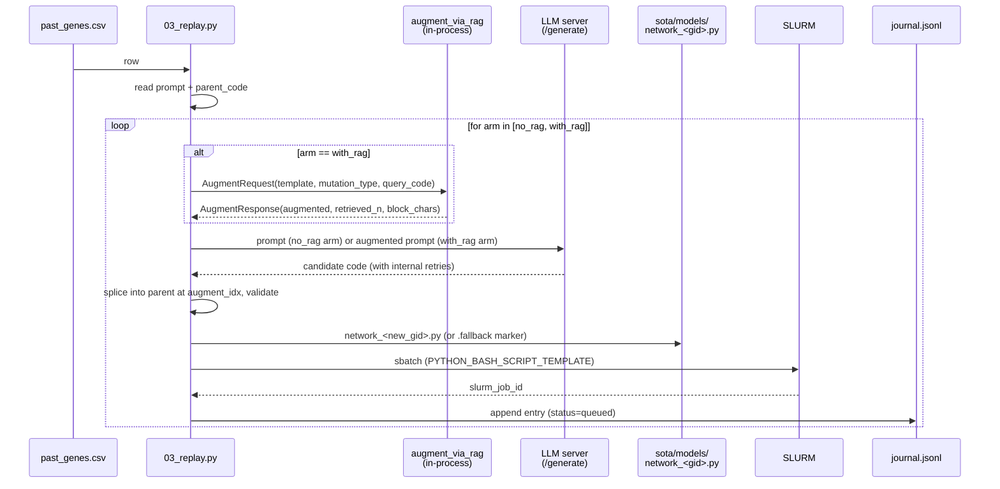

# 02 — Replay loop design

`scripts/rag_replay/03_replay.py` is the for-loop that turns each row of
`past_genes.csv` into two regenerated genes (one per arm) and queues two SLURM
training jobs per source row.

## Sequence (per source gene)



After all source genes are processed, `_poll_results` (`scripts/rag_replay/03_replay.py:209`)
walks the journal, polls `experiments/rag_replay/<ts>/results/<new_gid>_results.txt`
every 60s, and detects failed jobs via `sacct`. It rewrites `journal.jsonl`
in place with final status (`done`, `failed`, or `timeout`).

## Why we don't call `augment_network` directly

Production `src/llm_mutation.py:augment_network` does
`template_text.format(parent_code_part)` on the **template file**. Our
"templates" are already-substituted historical prompts — there is no `{}`
placeholder to fill. We replicate the relevant slice of `augment_network`
inline in `_generate_for_arm` (`scripts/rag_replay/03_replay.py:114`):

1. Call `generate_augmented_code(prompt, augment_idx-1, ...)` from
   `src/llm_utils.py:158` — this handles the LLM submit + clean + validate +
   retry-with-error-feedback inside a single call.
2. Splice the returned code into the parent at the discovered `augment_idx`
   (see below) via `_splice_and_validate`
   (`scripts/rag_replay/03_replay.py:90`), which calls
   `validate_module_source` from `src/llm_utils.py:125`.
3. On all-attempts-fail, write the parent code as-is and emit a `.fallback`
   marker — same convention as production.

The retry-loop semantics:

```mermaid
flowchart TD
    A[for attempt in MAX_RETRIES] --> B[generate_augmented_code<br/>(internal LLM retries on parse failure)]
    B -- raises --> EX[record error, break outer loop]
    B -- success --> C[splice + validate_module_source]
    C -- ok --> OK[write network_<gid>.py, return n_attempts, fallback=False]
    C -- fail --> D[record validation error]
    D --> A
    A -- exhausted --> FB[write parent + .fallback marker, return fallback=True]
```

`LLM_GENERATION_MAX_RETRIES=3` (`src/cfg/constants.py`). Worst case is
`3 outer × 3 inner = 9 LLM calls` per arm — matches production.

## Augment-idx inference

`_find_augment_idx` (`scripts/rag_replay/03_replay.py:74`):

```
parts = split_file(parent_path)   # one section per `# --OPTION--` boundary
for idx in range(1, len(parts)):
    cls = first `class <Name>:` line in parts[idx]
    if `class <cls>` appears in prompt AND parts[idx][:40] is in prompt:
        return idx
return 1   # fallback
```

This re-derives the augment_idx from the prompt body (the prompt embeds the
parent class block in a fenced ```python``` block). When it can't match
deterministically — for templates that have heavily mangled the parent
section — we default to `idx=1`. The CSV column `orig_eligible_for_rag` filters
to `TEMPLATE_BASED` mutations where this pattern holds; `CrossOver` and
`CREATED` rows are excluded by default via `--eligible-only`.

## SLURM submission

`_render_sbatch` (`scripts/rag_replay/03_replay.py:158`) reuses
`PYTHON_BASH_SCRIPT_TEMPLATE` from `src/cfg/constants.py:160`, plugging in
`-network "models.network_<new_gid>"` and `-epoch <args.epochs>`. The script
is written under `experiments/rag_replay/<ts>/sbatch/<new_gid>.sh`.

`_submit` (`scripts/rag_replay/03_replay.py:178`) calls
`sbatch --parsable --export=ALL <script>` with `RUN_DIR` and
`LLM_INFERENCE_ROOT_DIR` injected into the env so `train.py:282` writes results
to `experiments/rag_replay/<ts>/results/<new_gid>_results.txt`.

## Resumability

If the driver is killed mid-run (slurm timeout, ssh drop, ...):

```bash
# Re-run with --poll-only to pick up where we left off
.venv/bin/python scripts/rag_replay/03_replay.py \
  --output experiments/rag_replay/<existing_ts> \
  --poll-only
```

The journal already has `slurm_job_id` for every queued entry; the poll loop
fills in `test_acc/params/...` for any that completed.

If we want to add **more** rows without re-submitting existing ones:
deduplication is by `(orig_gene_id, arm)` in `_read_journal` — re-running with
a higher `--max-rows` will re-queue rows already journalled. The simplest
workaround is to copy the existing CSV minus already-queued rows into a fresh
one and run with that.
